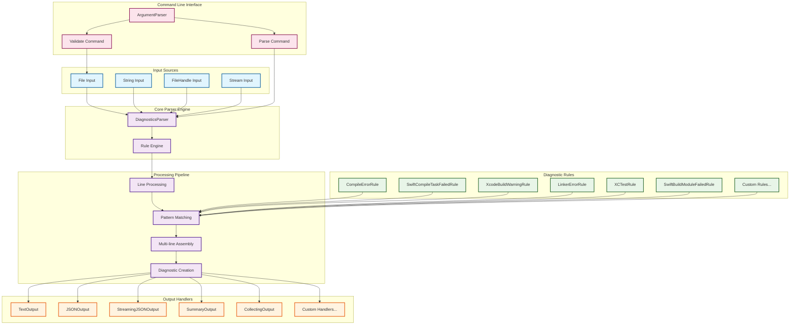
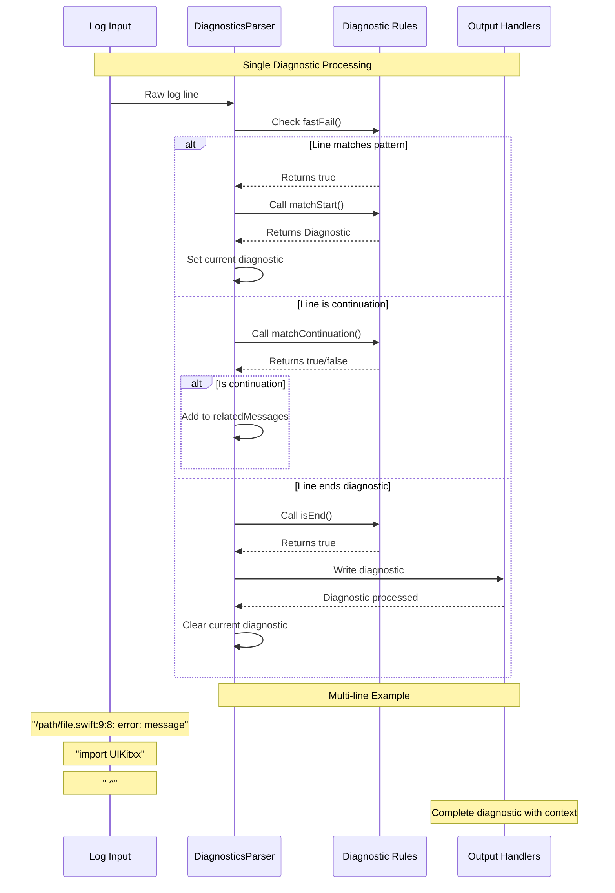
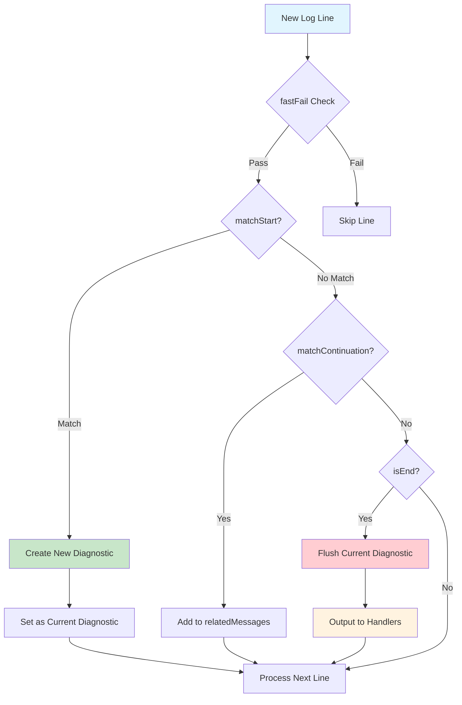

# BuildLogParser

A Swift package for parsing Xcode and Swift build logs into structured diagnostic information. BuildLogParser can extract compilation errors, warnings, test failures, and other build issues from log files, making them easier to analyze programmatically.

## Features

- 🔍 **Multi-format Log Parsing**: Supports both `xcodebuild` and `swift build` log formats
- 📊 **Structured Output**: Parse logs into structured `Diagnostic` objects with file, line, severity, and message information
- 🧪 **Test Result Parsing**: Extract unit test results and failures using Swift Testing framework
- 🛠️ **Command Line Tool**: Built-in CLI for parsing logs from the command line
- 📝 **Multiple Output Formats**: Support for text, JSON, and summary output formats
- ⚡ **Performance Optimized**: Fast-fail optimization for efficient log processing
- 🔄 **Streaming Support**: Process large log files with streaming input/output
- 🌐 **Cross-platform**: Works on macOS and Linux

## Architecture

BuildLogParser follows a modular architecture with clear separation of concerns:



### Key Components:

- **Input Sources**: Multiple ways to provide log data (files, strings, streams)
- **Core Parser**: Central engine that orchestrates the parsing process
- **Diagnostic Rules**: Pluggable pattern matchers for different log formats
- **Processing Pipeline**: Multi-stage processing with line-by-line analysis
- **Output Handlers**: Flexible output formatting and destination options
- **CLI Interface**: Command-line tools for direct usage

### Diagnostic Processing Flow:



### Rule Processing Priority:



## Installation

### Swift Package Manager

Add BuildLogParser to your `Package.swift`:

```swift
dependencies: [
    .package(url: "https://github.com/aelam/BuildLogParser.git", from: "1.0.0")
]
```

### Command Line Tool

Build and install the CLI tool:

```bash
git clone https://github.com/aelam/BuildLogParser.git
cd BuildLogParser
swift build -c release
cp .build/release/buildlog-parser /usr/local/bin/
```

Or use Swift Package Manager directly:

```bash
swift package install buildlog-parser
```

## Quick Start

### Command Line Usage

Parse a build log file:

```bash
# Parse xcodebuild log
buildlog-parser parse build.log

# Parse with JSON output
buildlog-parser parse build.log --format json --output diagnostics.json

# Parse from stdin with summary
xcodebuild test | buildlog-parser parse - --format summary

# Show only errors
buildlog-parser parse build.log --errors-only

# Include statistics
buildlog-parser parse build.log --show-stats --format summary
```

### Programmatic Usage

```swift
import BuildLogParser

// Create parser with rules
let rules: [DiagnosticRule] = [
    SwiftBuildCompileErrorRule(),
    LinkerErrorRule(),
    XCTestRule()
]

let parser = DiagnosticsParser(rules: rules)

// Add output handler
parser.setDiagnosticHandler { diagnostic in
    print("Found \(diagnostic.severity): \(diagnostic.message)")
    if let file = diagnostic.file, let line = diagnostic.line {
        print("  at \(file):\(line)")
    }
}

// Parse from file
let input = FileInput(URL(fileURLWithPath: "build.log"))
try parser.parse(input: input)
```

## Supported Log Formats

### Build Errors and Warnings

BuildLogParser can extract diagnostics from various build tools:

- **Swift Compiler Errors**: Parse `swift build` compilation errors and warnings
- **Xcode Build Errors**: Extract diagnostics from `xcodebuild` output
- **Linker Errors**: Identify and parse linker error messages
- **Module Build Failures**: Parse Swift module compilation failures

### Test Results

- **XCTest Output**: Parse traditional XCTest results and failures
- **Swift Testing**: Extract results from Swift Testing framework output
- **Test Suites**: Organize test results by suite and individual test cases

## API Reference

### Core Classes

#### `DiagnosticsParser`

The main parser class that processes build logs using configurable rules.

```swift
public class DiagnosticsParser {
    public init(rules: [DiagnosticRule])
    public func addOutput(_ output: DiagnosticOutput)
    public func parse(input: DiagnosticInput) throws
    public func parse(input: AsyncDiagnosticInput) async throws // macOS 10.15+
}
```

#### `Diagnostic`

Represents a single diagnostic message (error, warning, etc.).

```swift
public struct Diagnostic {
    public let message: String
    public let severity: DiagnosticSeverity
    public let file: String?
    public let line: Int?
    public let column: Int?
    public var relatedMessages: [String]
}

public enum DiagnosticSeverity {
    case error, warning, info, note
}
```

### Input Sources

#### File Input
```swift
let input = FileInput(URL(fileURLWithPath: "build.log"))
try parser.parse(input: input)
```

#### String Input
```swift
let input = StringInput(logContent)
try parser.parse(input: input)
```

#### Streaming Input
```swift
let input = FileHandleInput(FileHandle.standardInput)
try parser.parse(input: input)
```

### Output Destinations

#### Callback Output
```swift
parser.setDiagnosticHandler { diagnostic in
    // Handle each diagnostic as it's parsed
    print("Found: \(diagnostic.message)")
}
```

#### Collecting Output
```swift
let collector = CollectingOutput()
parser.addOutput(collector)
try parser.parse(input: input)
let allDiagnostics = collector.getAllDiagnostics()
```

#### Print Output
```swift
let printOutput = PrintOutput()
parser.addOutput(printOutput)
```

### Custom Rules

Create custom diagnostic rules by implementing `DiagnosticRule`:

```swift
struct CustomRule: DiagnosticRule {
    func fastFail(line: String) -> Bool {
        // Quick check to avoid expensive regex
        return line.contains("MY_ERROR:")
    }
    
    func matchStart(line: String) -> Diagnostic? {
        // Parse the start of a diagnostic
        if line.hasPrefix("MY_ERROR:") {
            return Diagnostic(
                message: String(line.dropFirst("MY_ERROR:".count)),
                severity: .error,
                file: nil,
                line: nil,
                column: nil
            )
        }
        return nil
    }
    
    func matchContinuation(line: String, current: Diagnostic?) -> Bool {
        // Check if this line continues the current diagnostic
        return line.hasPrefix("    ")
    }
    
    func isEnd(line: String, current: Diagnostic?) -> Bool {
        // Check if this line ends the current diagnostic
        return !line.hasPrefix("    ")
    }
}
```

## Command Line Interface

### Commands

#### `parse`
Parse build log files and extract diagnostics.

```bash
buildlog-parser parse [OPTIONS] <INPUT_FILE>
```

**Options:**
- `--output, -o <PATH>`: Output file path (default: stdout)
- `--format <FORMAT>`: Output format: text, json, summary (default: text)
- `--verbose`: Include verbose diagnostic information
- `--errors-only`: Only show errors (exclude warnings and info)
- `--show-stats`: Display statistics summary

#### `validate`
Validate that a build log file is readable and well-formed.

```bash
buildlog-parser validate [OPTIONS] <INPUT_FILE>
```

**Options:**
- `--verbose`: Show detailed validation information

### Examples

```bash
# Basic parsing
buildlog-parser parse build.log

# JSON output with statistics
buildlog-parser parse build.log --format json --show-stats --output result.json

# Process xcodebuild output directly
xcodebuild clean build test | buildlog-parser parse - --format summary

# Only errors with verbose output
buildlog-parser parse build.log --errors-only --verbose

# Validate log file
buildlog-parser validate build.log --verbose
```

## Output Formats

### Text Format
Human-readable output with emoji indicators:
```
❌ ViewController.swift:42: error - Use of undeclared identifier 'unknownVariable'
⚠️ DataManager.swift:15: warning - Variable 'data' was never used
```

### JSON Format
Structured output suitable for integration with other tools:
```json
{
  "diagnostics": [
    {
      "message": "Use of undeclared identifier 'unknownVariable'",
      "severity": "error",
      "file": "ViewController.swift",
      "line": 42,
      "column": 10,
      "relatedMessages": []
    }
  ],
  "metadata": {
    "totalCount": 1,
    "errorCount": 1,
    "warningCount": 0,
    "timestamp": "2025-09-15T10:30:00Z"
  }
}
```

### Summary Format
Brief overview with statistics:
```
📊 Build Log Analysis Summary
═══════════════════════════════════════════════════════════════

Total Issues Found: 3

❌ Errors: 1
⚠️ Warnings: 2

✅ Analysis completed
```

## Requirements

- **Swift**: 5.9 or later
- **Platforms**: macOS 10.15+, Linux
- **Dependencies**: Swift ArgumentParser (for CLI only)

## Testing

Run the test suite:

```bash
swift test
```

Run tests with verbose output:

```bash
swift test --verbose
```

## Contributing

Contributions are welcome! Please feel free to submit a Pull Request. For major changes, please open an issue first to discuss what you would like to change.

### Development Setup

1. Clone the repository
2. Install dependencies: `swift package resolve`
3. Build: `swift build`
4. Run tests: `swift test`
5. Build CLI: `swift build -c release`

### Adding New Rules

To add support for new types of build errors:

1. Create a new rule class implementing `DiagnosticRule`
2. Add the rule to the default rule set in `BuildLogParserCommand.swift`
3. Add test cases in `BuildLogParserTests`
4. Update documentation

## License

This project is licensed under the MIT License - see the [LICENSE](LICENSE) file for details.

## Changelog

### Version 1.0.0
- Initial release
- Support for Swift build and Xcode build log parsing
- Command line interface with multiple output formats
- Swift Testing framework integration
- Cross-platform support (macOS and Linux)
- Performance optimizations with fast-fail checking

## Related Projects

- [Swift ArgumentParser](https://github.com/apple/swift-argument-parser) - Command line argument parsing
- [Swift Testing](https://github.com/apple/swift-testing) - Modern testing framework for Swift 