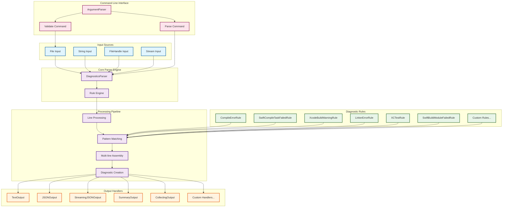
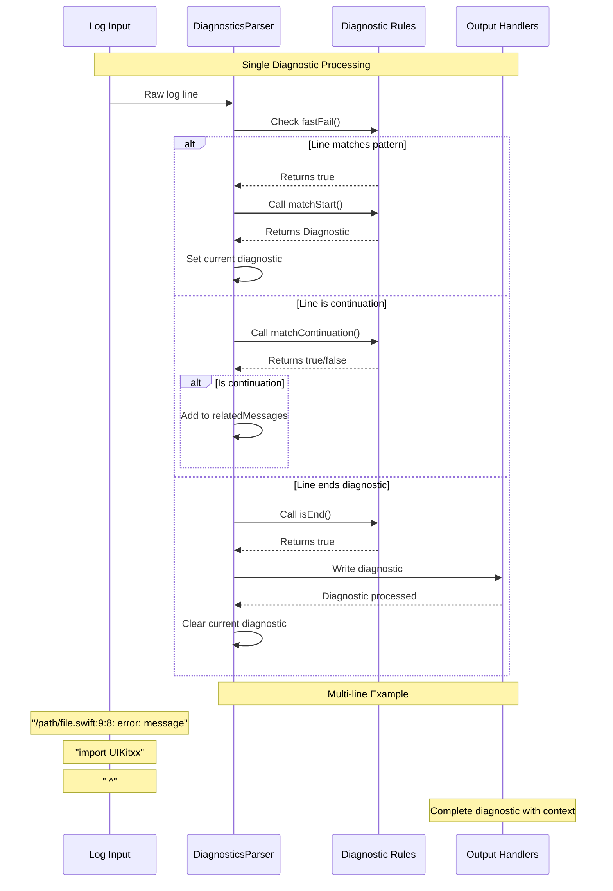
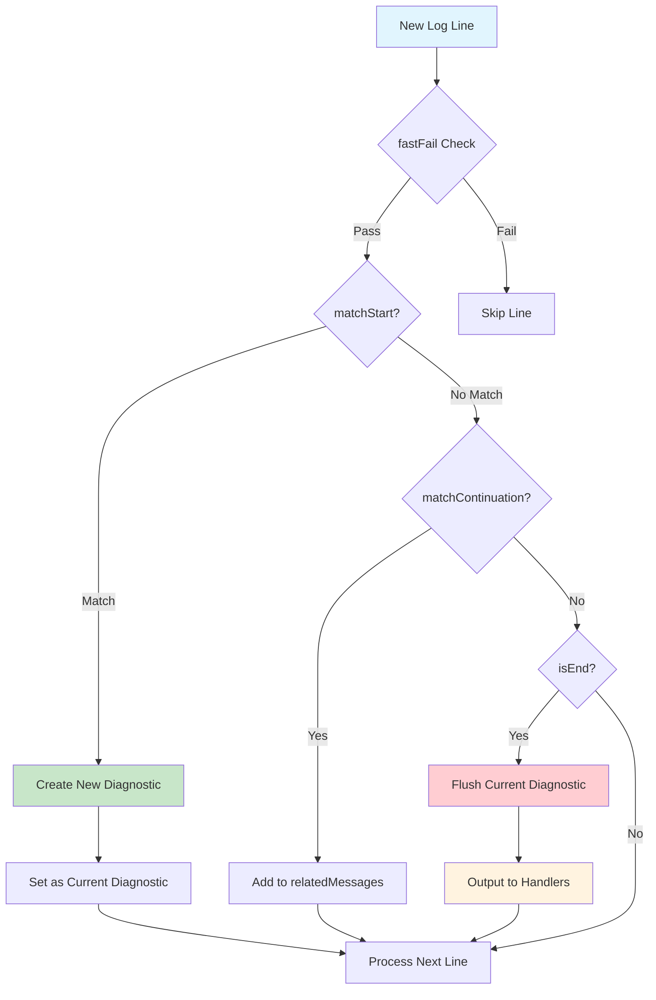

# Architecture

BuildLogParser follows a modular architecture with clear separation of concerns:

### Key Components:

- **Input Sources**: Multiple ways to provide log data (files, strings, streams)
- **Core Parser**: Central engine that orchestrates the parsing process
- **Diagnostic Rules**: Pluggable pattern matchers for different log formats
- **Processing Pipeline**: Multi-stage processing with line-by-line analysis
- **Output Handlers**: Flexible output formatting and destination options
- **CLI Interface**: Command-line tools for direct usage

### Diagnostic Processing Flow:

### Rule Processing Priority:

